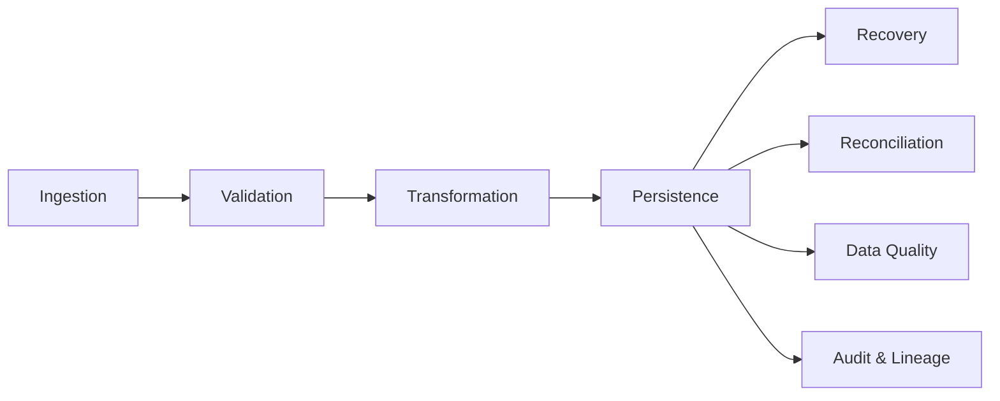

# COMPONENT_DIAGRAM.md

# Mini BOP — Component Diagram

> Visão conceitual dos principais componentes da arquitetura.

> **Importante**
>
> Este diagrama representa responsabilidades arquiteturais. A existência e organização exatas dos componentes devem sempre ser confirmadas no código-fonte e na documentação oficial.

---

# Objetivo

Apresentar como as principais responsabilidades do Mini BOP se relacionam entre si.

---

# Component Diagram

---

# Componentes

## Ingestion

Recebe os dados provenientes dos sistemas de origem.

## Validation

Aplica validações técnicas e de negócio antes do processamento definitivo.

## Transformation

Normaliza e prepara os dados para persistência.

## Persistence

Armazena os dados aprovados pelo pipeline.

## Recovery

Permite recuperação e reprocessamento controlado.

## Reconciliation

Produz evidências operacionais de consistência.

## Data Quality

Avalia indicadores de qualidade dos dados produzidos.

## Audit & Lineage

Mantém rastreabilidade do processamento.

---

# Responsabilidades

| Componente | Responsabilidade |
|------------|------------------|
| Ingestion | Entrada de dados |
| Validation | Validação |
| Transformation | Preparação dos dados |
| Persistence | Persistência |
| Recovery | Recuperação |
| Reconciliation | Reconciliação |
| Data Quality | Qualidade |
| Audit & Lineage | Governança |

---

# Relação com outros documentos

- SYSTEM_CONTEXT.md
- CONTEXT_DIAGRAM.md
- DOMAIN_MODEL.md
- ARCHITECTURE.md
- Academy
- ADR

---

# Observação

Este documento representa uma visão arquitetural de alto nível. O mapeamento para packages, tabelas e scripts deverá ser refinado durante o code review, sempre utilizando o código do Mini BOP como fonte de verdade.

---

# Próximo passo

Após compreender os componentes, recomenda-se consultar:

1. SEQUENCE_DIAGRAMS.md
2. ARCHITECTURE.md
3. Academy
