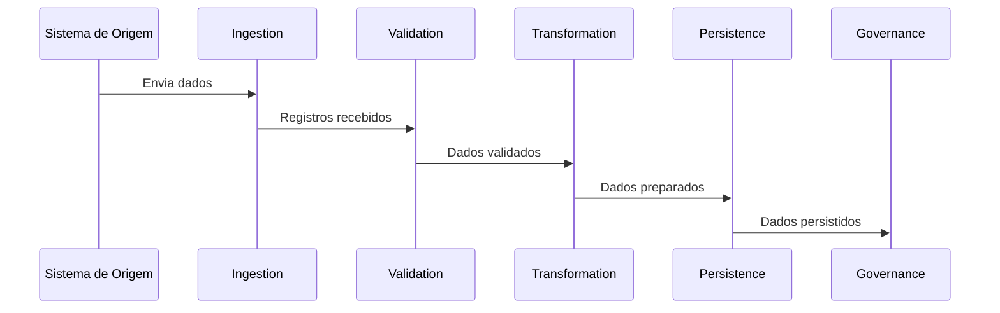
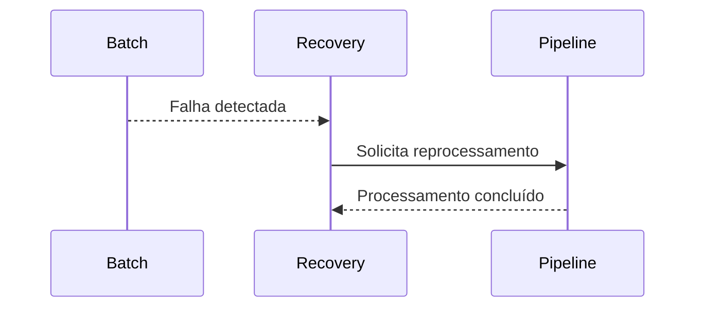
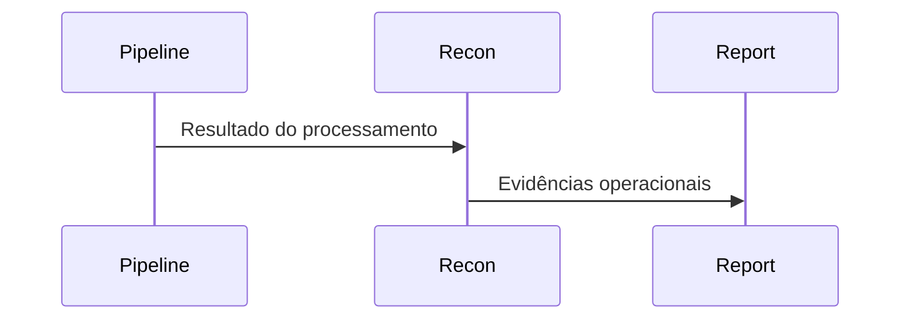
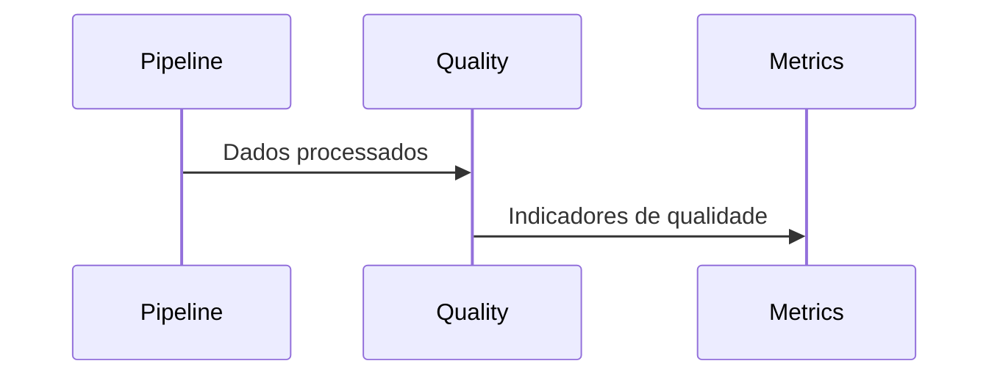

# SEQUENCE_DIAGRAMS.md

# Mini BOP — Sequence Diagrams

> Diagramas de sequência conceituais do fluxo de processamento.

> **Importante**
>
> Estes diagramas representam o comportamento esperado em alto nível. O fluxo exato deve sempre ser validado no código-fonte e na documentação oficial do projeto.

---

# Objetivo

Demonstrar, passo a passo, como um Trade percorre o pipeline do Mini BOP.

---

# Fluxo Principal

---

# Fluxo de Recovery

---

# Fluxo de Reconciliation

---

# Fluxo de Data Quality

---

# Observações

Os diagramas apresentados possuem finalidade didática e complementam:

- SYSTEM_CONTEXT.md
- CONTEXT_DIAGRAM.md
- COMPONENT_DIAGRAM.md
- ARCHITECTURE.md
- Mini BOP Academy

O detalhamento das chamadas entre packages deverá ser refinado durante o code review, utilizando exclusivamente o código do projeto como referência.

---

# Próximo passo

Após compreender os fluxos conceituais recomenda-se aprofundar a implementação consultando:

1. ARCHITECTURE.md
2. Academy
3. ADR
4. Código-fonte
