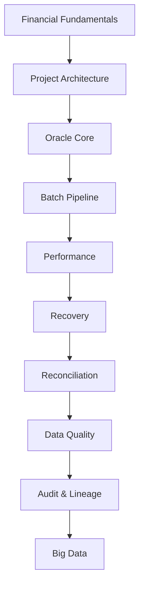

# Mini BOP Academy

# Module 00 — Welcome

> **Purpose:** Introduce the project, the Academy philosophy and the recommended learning path.

---

# Welcome

## 🇧🇷 Português (PT-BR)

Bem-vindo ao **Mini BOP Academy**.

Este material foi criado para funcionar como o onboarding técnico de um novo integrante da equipa. O objetivo não é apenas explicar o código, mas apresentar os conceitos de negócio, arquitetura, engenharia de dados e decisões técnicas utilizadas no projeto.

Ao final da Academy, o leitor deverá compreender:

- O domínio financeiro necessário para entender os exemplos.
- A arquitetura Oracle do Mini BOP.
- O pipeline completo de processamento.
- Os conceitos de qualidade, auditoria e observabilidade.
- Como essa arquitetura evolui para um ecossistema moderno de Data Engineering.

---

## 🇺🇸 English (EN-US)

Welcome to the **Mini BOP Academy**.

This Academy is designed as the technical onboarding for new contributors. Rather than simply documenting the code, it explains the business concepts, architecture, engineering decisions and implementation patterns used throughout the project.

By the end of the Academy you should understand:

- The financial concepts behind the examples.
- The Oracle-based architecture.
- The end-to-end processing pipeline.
- Data quality, observability and audit concepts.
- How the same architecture can evolve into a modern Data Engineering platform.

---

## 🇫🇷 Français (FR-FR)

Bienvenue dans la **Mini BOP Academy**.

Cette Academy constitue un parcours d'intégration technique destiné aux nouveaux contributeurs. Elle explique les concepts métier, l'architecture, les choix d'ingénierie et les implémentations du projet.

À la fin de cette Academy, vous serez capable de comprendre :

- Les concepts financiers nécessaires.
- L'architecture Oracle du projet.
- Le pipeline complet de traitement.
- Les notions de qualité des données, d'audit et d'observabilité.
- L'évolution vers une architecture moderne de Data Engineering.

---

# Academy Philosophy

The Academy follows four principles:

1. **Business before Technology** — Understand the business problem first.
2. **Architecture before Code** — Understand the design before reading PL/SQL.
3. **Code before Optimization** — Learn the implementation before discussing performance.
4. **Engineering before Tools** — Focus on principles rather than products.

---

# Learning Path

---

# Repository as a Learning Platform

Mini BOP should be viewed from three complementary perspectives:

| Perspective | Goal |
|------------|------|
| Business | Understand financial processing concepts |
| Software Engineering | Understand architecture and implementation |
| Data Engineering | Understand how Oracle integrates with modern data platforms |

---

# What this Academy is NOT

- It is not a finance course.
- It is not an Oracle manual.
- It is not a Hadoop tutorial.

Instead, it connects these topics using a single coherent project.

---

# Next Module

➡ **01_FINANCIAL_FUNDAMENTALS.md**
