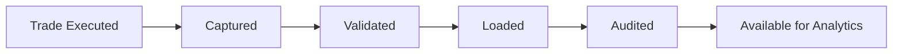

# Module 01 — Financial Fundamentals

> Understanding the business domain before reading the code.

---

# Why start with Finance?

## 🇧🇷 PT-BR

Antes de compreender o pipeline do Mini BOP é importante entender o problema de negócio que ele resolve.

O projeto representa uma plataforma simplificada de processamento de operações financeiras (**Trades**). Seu objetivo não é reproduzir um banco completo, mas demonstrar como um pipeline corporativo recebe, valida, transforma, audita e disponibiliza dados financeiros com rastreabilidade e governança.

## 🇺🇸 EN-US

Before understanding the Mini BOP pipeline, it is essential to understand the business problem it solves.

The project represents a simplified financial transaction processing platform. It demonstrates how an enterprise-grade pipeline ingests, validates, transforms, audits and publishes financial data.

## 🇫🇷 FR-FR

Avant d'étudier le pipeline Mini BOP, il est essentiel de comprendre le contexte métier.

Le projet représente une plateforme simplifiée de traitement de transactions financières illustrant les principales étapes d'un pipeline d'entreprise.

---

# Core Concepts

| Concept | Definition |
|---------|------------|
| Trade | A financial transaction between counterparties. |
| Instrument | The financial product being negotiated. |
| Counterparty | The other party involved in the transaction. |
| Trade Date | Date when the trade is executed. |
| Settlement Date | Date when ownership/cash is exchanged. |

---

# Simplified Trade Lifecycle

---

# Why does Mini BOP exist?

The project demonstrates how a controlled batch pipeline can:

- ingest financial operations;
- validate business rules;
- transform raw information;
- load curated data;
- maintain auditability;
- measure quality and operational health.

---

# Relationship with the Code

The concepts introduced here appear throughout the project:

| Business Concept | Project Component |
|------------------|-------------------|
| Trade reception | STG_TRADE_RAW |
| Validation | Validation packages |
| Curated trade | TRADE |
| Business history | TRADE_EVENT |
| Batch execution | ETL_BATCH |
| Operational logging | ETL_LOG |

---

# Engineering Notes

The Academy intentionally introduces the business domain before Oracle implementation. This mirrors the onboarding process commonly adopted in enterprise financial systems, where understanding the business vocabulary is a prerequisite for understanding the software architecture.

---

# Summary

After this module you should understand:

- What a Trade is.
- Why financial transactions require controlled processing.
- Why a pipeline needs validation, auditing and governance.
- How these concepts map to the Mini BOP data model.

---

# Next Module

➡ **02_FINANCIAL_INSTRUMENTS.md**
