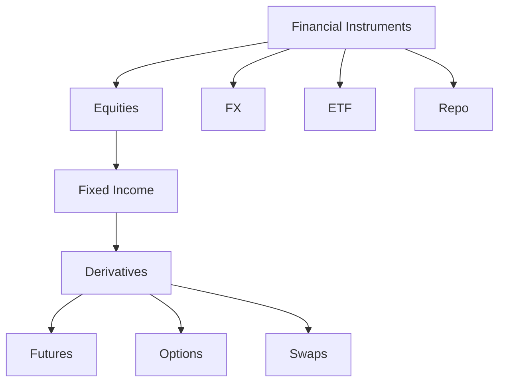
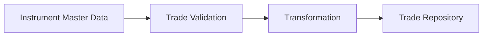

# Module 02 — Financial Instruments

> Understanding the financial products processed by the Mini BOP pipeline.

---

# Introduction

Financial systems do not process generic records. They process **financial instruments**.

A Trade always represents an operation involving one instrument.

---

# Instrument vs Trade

| Concept | Meaning |
|---------|---------|
| Financial Instrument | The asset or contract being negotiated. |
| Trade | The transaction involving that instrument. |

---

# Main Financial Instruments

## Equity

**PT-BR:** Representa participação em uma empresa através de ações.

**EN-US:** Represents ownership in a company through shares.

**FR-FR:** Représente une participation dans une entreprise au moyen d'actions.

Example:

```text
Buy 100 shares of Company ABC.
```

---

## Bond

A debt instrument where the issuer borrows money from investors and pays interest until maturity.

---

## Future

A standardized contract agreeing today on a future purchase or sale at a predefined price.

Typical use:

- Hedging
- Speculation

---

## Option

An option gives the holder the **right**, but not the obligation, to buy or sell an asset before a specified date.

---

## FX (Foreign Exchange)

Currency exchange transactions.

Example:

```text
EUR → USD
```

---

## Swap

Agreement where two parties exchange financial cash flows.

Common examples:

- Interest Rate Swap
- Currency Swap

---

## ETF

Exchange Traded Fund.

A fund traded like a stock.

---

## Repo

Repurchase Agreement.

Short-term financing operation backed by securities.

---

# Simplified Classification



---

# Where do these concepts appear in Mini BOP?

The project uses master data to classify and validate financial instruments before processing trades.

Typical flow:



---

# Engineering Notes

One of the first responsibilities of the pipeline is verifying that the referenced instrument exists and is valid before allowing the trade to continue through the processing stages.

Separating **instrument master data** from **trade data** is a common architectural practice because instruments are relatively static while trades are continuously generated.

---

# Summary

After this module you should understand:

- The difference between an instrument and a trade.
- The main financial instruments used in enterprise systems.
- Why master data is required before processing trades.
- How business concepts influence pipeline design.

---

# Next Module

➡ **03_MINI_BOP_ARCHITECTURE.md**
