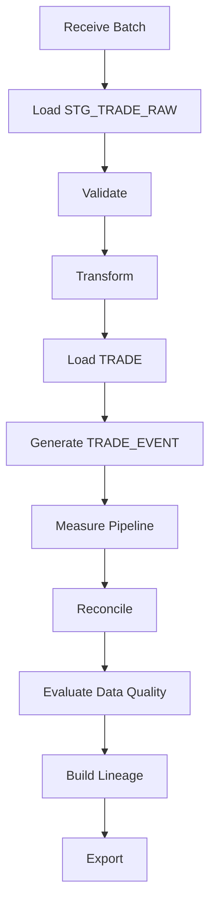

# Module 03 — Mini BOP Architecture

> Understanding the complete architecture before diving into the source code.

---

# Why Architecture First?

Large enterprise systems cannot be understood by reading isolated procedures.

Before opening a package, we must understand how every component collaborates to solve a business problem.

---

# High-Level Architecture

---

# Layered Architecture

| Layer | Responsibility |
|-------|----------------|
| Source | External systems producing trades |
| Staging | Raw data ingestion |
| Validation | Business and reference validation |
| Transformation | Data enrichment |
| Core | Curated trade repository |
| Operations | Monitoring, recovery and reconciliation |
| Governance | Data Quality and Lineage |
| Integration | Big Data export |

---

# End-to-End Processing

---

# Architectural Principles

## Separation of Responsibilities

Each package has a focused responsibility.

Examples:

- Validation validates.
- Recovery recovers.
- Reconciliation compares.
- Data Quality measures quality.
- Lineage records traceability.

---

## Batch-Oriented Processing

Mini BOP is intentionally batch-oriented.

This allows:

- repeatability;
- traceability;
- recovery;
- auditability.

---

## Governance by Design

Governance is not an afterthought.

It is implemented through:

- ETL batches
- Operational logs
- Data Quality
- Audit Lineage
- Reconciliation

---

# Oracle Core Components

| Component | Purpose |
|-----------|---------|
| STG_TRADE_RAW | Raw ingestion |
| TRADE | Curated trade repository |
| TRADE_EVENT | Business history |
| ETL_BATCH | Batch lifecycle |
| ETL_LOG | Operational logging |

---

# Engineering Notes

Mini BOP demonstrates an enterprise architecture where operational concerns (monitoring, recovery, reconciliation and governance) are treated as first-class citizens instead of being embedded inside business logic.

This separation simplifies maintenance and future evolution.

---

# Looking Ahead

Later Academy modules explain how these Oracle components could evolve into a modern Data Engineering platform using technologies such as Hadoop, Spark and Airflow while preserving the same architectural responsibilities.

---

# Summary

After this module you should understand:

- The major architectural layers.
- The end-to-end processing flow.
- Why the project is organized into specialized packages.
- How governance is integrated into the pipeline.

---

# Next Module

➡ **04_ORACLE_CORE.md**
