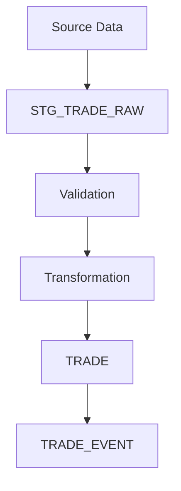

# Module 04 — Oracle Core

> Understanding the Oracle layer that powers the Mini BOP pipeline.

---

# Overview

The Oracle database is the operational core of Mini BOP.

It is responsible for receiving raw data, validating business rules, transforming information, loading curated trades and maintaining operational governance.

Unlike a simple CRUD application, Mini BOP models a complete enterprise batch pipeline.

---

# Oracle Layers

---

# Main Tables

| Table | Responsibility |
|-------|----------------|
| STG_TRADE_RAW | Raw staging area for incoming trades |
| STG_TRADE_ERROR | Validation and processing errors |
| TRADE | Curated trade repository |
| TRADE_EVENT | Trade lifecycle history |
| ETL_BATCH | Batch execution metadata |
| ETL_LOG | Operational logging |

---

# Why a Staging Area?

Incoming data is never loaded directly into the business tables.

Reasons:

- isolate external systems;
- validate before persistence;
- allow replay and recovery;
- simplify auditing.

---

# Package Responsibilities

| Package | Primary Responsibility |
|---------|------------------------|
| Validation | Verify business rules and reference data |
| Transform | Enrich and normalize records |
| Load | Persist curated trades |
| Recovery | Reprocess failed batches |
| Reconciliation | Compare expected vs processed data |
| Data Quality | Measure quality indicators |
| Audit & Lineage | Record traceability |

---

# Engineering Decisions

Mini BOP deliberately separates processing responsibilities into specialized PL/SQL packages.

Benefits:

- lower coupling;
- higher cohesion;
- easier maintenance;
- better testability.

---

# Oracle Concepts Demonstrated

- Batch processing
- Bulk processing
- Collections
- FORALL
- Transaction management
- Logging
- Auditing
- Idempotent processing

---

# Looking Forward

The next Academy modules explain how these Oracle responsibilities map to modern Data Engineering technologies such as:

- Hadoop
- Spark
- Airflow
- dbt

The business responsibilities remain the same even if the implementation technology changes.

---

# Summary

You should now understand:

- Why Oracle is the operational core.
- The purpose of each main table.
- Why staging is essential.
- Why the project is organized into focused packages.

---

# Next Module

➡ **05_BATCH_PIPELINE.md**
