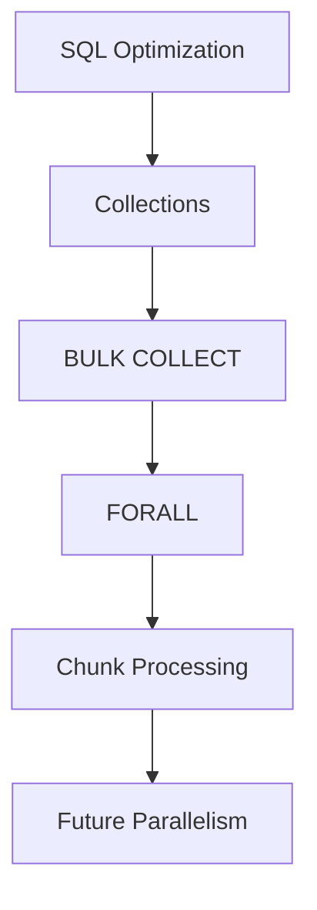

# Module 06 — Performance

> Understanding why performance is a first-class concern in enterprise batch pipelines.

---

# Why Performance Matters

Financial platforms routinely process thousands or millions of transactions.

A correct pipeline that misses its processing window can still become an operational problem.

Mini BOP demonstrates performance techniques commonly found in Oracle-based enterprise systems.

---

# Performance Objectives

- Reduce execution time
- Reduce database round-trips
- Reduce context switches
- Improve scalability
- Preserve correctness

---

# Performance Layers

---

# Main Concepts

## Collections

Collections allow groups of rows to be processed in memory rather than one record at a time.

---

## BULK COLLECT

Loads multiple rows into PL/SQL collections with a single context switch.

Benefits:

- fewer SQL/PLSQL transitions
- lower overhead

---

## FORALL

Persists collection contents using set-oriented execution.

Benefits:

- fewer DML statements
- better throughput

---

## Chunk Processing

Large workloads are divided into smaller execution units.

Advantages:

- controlled memory usage
- easier recovery
- future parallel execution

---

# Performance vs Architecture

Performance decisions should not compromise maintainability.

Mini BOP separates business logic from optimization techniques.

This allows the same business rules to execute using different strategies without changing the functional behavior.

---

# Engineering Notes

Performance is treated as an architectural concern rather than a last-minute optimization.

The project illustrates concepts such as:

- bulk processing
- chunking
- idempotent execution
- recovery-aware processing

These concepts will later be compared with distributed processing in Apache Spark.

---

# Future Evolution

Potential architectural improvements include:

- parallel chunk execution;
- richer operational metrics;
- adaptive chunk sizing.

These improvements preserve the existing architecture while increasing throughput.

---

# Summary

After this module you should understand:

- Why bulk processing exists.
- Why chunking improves scalability.
- The difference between optimization and business logic.
- How these concepts prepare the project for modern Data Engineering platforms.

---

# Next Module

➡ **07_RECOVERY.md**
