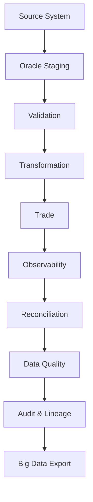

# Mini BOP Academy

> Enterprise Onboarding Guide

---

# Welcome

Welcome to the **Mini BOP Academy**.

This guide is the official onboarding path for the Mini BOP project and complements the technical documentation already available in this repository.

Unlike a traditional README, this Academy explains **why** the project exists, **how** its architecture was designed and **how** each component works from both a business and engineering perspective.

---

# Purpose

The Academy has four objectives:

1. Teach the financial concepts required to understand the project.
2. Explain the architecture layer by layer.
3. Perform a guided code review of the project.
4. Prepare contributors to maintain and evolve the platform.

---

# Languages

Every Academy module is written in three languages:

| Language | Purpose |
|----------|---------|
| 🇧🇷 Portuguese (PT-BR) | Primary learning language |
| 🇺🇸 English (EN-US) | International technical documentation |
| 🇫🇷 French (FR-FR) | Additional multilingual reference |

---

# Learning Philosophy

Every module follows the same structure:

1. Business Context
2. Technical Concepts
3. Mini BOP Implementation
4. Code Review
5. Engineering Decisions
6. Best Practices
7. Summary

---

# Academy Roadmap

| Module | Topic |
|--------|-------|
| 00 | Welcome |
| 01 | Financial Fundamentals |
| 02 | Financial Instruments |
| 03 | Mini BOP Architecture |
| 04 | Oracle Core |
| 05 | Batch Processing Pipeline |
| 06 | Performance |
| 07 | Recovery |
| 08 | Reconciliation |
| 09 | Data Quality |
| 10 | Audit & Lineage |
| 11 | Metadata Engine |
| 12 | Big Data Overview |
| 13 | Engineering Decisions |
| 14 | Technical Debt |
| 15 | Next Steps |

---

# Repository Navigation

```text
docs/
├── ONBOARDING_GUIDE.md
└── academy/
    ├── 00_WELCOME.md
    ├── 01_FINANCIAL_FUNDAMENTALS.md
    ├── 02_FINANCIAL_INSTRUMENTS.md
    └── ...
```

---

# Mermaid Example



---

# Related Documentation

- README.md
- ARCHITECTURE.md
- PROJECT_STRUCTURE.md
- ROADMAP.md
- FAQ.md
- TROUBLESHOOTING.md

---

# Next Module

➡ **academy/00_WELCOME.md**
