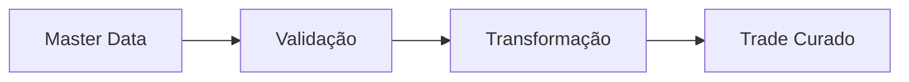

# Módulo 02 — Instrumentos Financeiros

> Conhecendo os ativos que percorrem o pipeline do Mini BOP.

---

# Objetivo

Ao final deste capítulo você deverá compreender:

- o que é um Instrumento Financeiro;
- a diferença entre Instrumento e Trade;
- os principais tipos de instrumentos encontrados em plataformas financeiras;
- por que o Master Data é essencial antes do processamento.

---

# Instrumento x Trade

Um erro comum de quem está iniciando é considerar que **Trade** e **Instrumento Financeiro** são a mesma coisa.

Eles não são.

| Conceito | Definição |
|----------|-----------|
| Instrumento Financeiro | O ativo, contrato ou produto negociado. |
| Trade | A operação de compra, venda ou negociação envolvendo esse instrumento. |

Exemplo:

- Instrumento: Ação da empresa ABC.
- Trade: Compra de 100 ações da empresa ABC.

---

# Principais Instrumentos

## 📈 Equity (Ações)

Representam participação em uma empresa.

Uso típico:

- investimento;
- dividendos;
- valorização patrimonial.

---

## 💵 Bond (Título de Dívida)

Representa um empréstimo feito ao emissor.

O investidor recebe juros até o vencimento.

---

## 📅 Future (Contrato Futuro)

Contrato padronizado para comprar ou vender um ativo em uma data futura por um preço previamente acordado.

Muito utilizado para hedge e especulação.

---

## 🎯 Option (Opção)

Concede ao comprador o **direito**, mas não a obrigação, de comprar ou vender um ativo.

---

## 💱 FX (Foreign Exchange)

Operações de compra e venda de moedas.

Exemplo:

EUR → USD

---

## 🔄 Swap

Contrato em que duas partes trocam fluxos financeiros.

Exemplo comum:

- taxa fixa por taxa variável.

---

## 📦 ETF

Fundo negociado em bolsa que representa uma carteira de ativos.

---

## 🤝 Repo

Operação de recompra utilizada como instrumento de financiamento de curto prazo.

---

# Como isso aparece no Mini BOP?

Antes que um Trade seja processado, o pipeline precisa validar se o instrumento referenciado existe e é conhecido.

Conceitualmente:

Essa separação entre **Master Data** e **Trades** evita inconsistências e melhora a governança.

---

# Decisão de Engenharia

No Mini BOP, os instrumentos pertencem ao domínio de **dados de referência (Master Data)**.

Eles mudam com pouca frequência.

Já os Trades representam eventos operacionais e são continuamente gerados.

Separar essas responsabilidades reduz redundância e simplifica a manutenção.

---

# Glossário

| Termo | Significado |
|--------|-------------|
| Instrumento | Produto financeiro negociado |
| Trade | Operação realizada |
| Master Data | Dados de referência relativamente estáveis |
| Hedge | Estratégia para reduzir risco |
| Settlement | Liquidação financeira da operação |

---

# O que você aprendeu

- A diferença entre Instrumento e Trade.
- Os principais instrumentos financeiros.
- O papel do Master Data.
- Como esses conceitos influenciam a arquitetura do Mini BOP.

---

# Próximo módulo

➡ **03_MINI_BOP_ARCHITECTURE.md**
