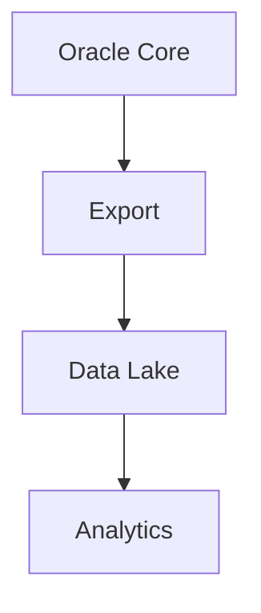

# Módulo 03 — Arquitetura do Mini BOP

> Visão arquitetural completa antes do estudo detalhado do código.

---

# Objetivo

Após este capítulo você deverá compreender:

- Qual problema o Mini BOP resolve;
- Como as camadas da solução se relacionam;
- Onde cada package atua;
- Como o pipeline evolui até Big Data.

---

# Princípio Fundamental

O Mini BOP foi concebido como uma **plataforma de processamento batch** com foco em:

- rastreabilidade;
- governança;
- recuperação;
- qualidade de dados;
- observabilidade.

O objetivo não é apenas carregar dados, mas construir um pipeline confiável.

---

# Visão Geral

---

# Camadas Arquiteturais

## 1. Ingestão

Recebe os dados externos preservando a informação original.

### Objetivo

- desacoplar sistemas;
- preservar dados brutos;
- permitir reprocessamento.

---

## 2. Validação

Aplica regras de negócio e verifica dados de referência.

Exemplos:

- instrumento válido;
- moeda existente;
- campos obrigatórios;
- consistência básica.

---

## 3. Transformação

Normaliza e enriquece os dados antes da persistência definitiva.

---

## 4. Repositório Curado

Armazena os Trades considerados válidos para consumo das demais camadas.

---

## 5. Governança

Após a carga entram responsabilidades não funcionais:

- Observabilidade;
- Recovery;
- Reconciliation;
- Data Quality;
- Audit & Lineage.

Essa separação foi uma decisão arquitetural importante para evitar que regras operacionais contaminem a lógica de negócio.

---

# Como o código está organizado

Em vez de uma única package gigante, o projeto divide responsabilidades.

Conceitualmente:

| Camada | Responsabilidade |
|--------|------------------|
| Scheduler | Orquestração |
| Validation | Regras |
| Transform | Enriquecimento |
| Load | Persistência |
| Recovery | Reprocessamento |
| Reconciliation | Evidência operacional |
| Data Quality | Indicadores |
| Audit | Rastreabilidade |

Esse modelo reduz acoplamento e aumenta coesão.

---

# Evolução para Big Data

A arquitetura Oracle representa o núcleo operacional.

Em uma evolução arquitetural, as mesmas responsabilidades poderiam ser distribuídas em tecnologias como Hadoop, Spark e Airflow, mantendo o mesmo fluxo lógico.

---

# Engineering Notes

Uma característica marcante do Mini BOP é tratar governança como parte integrante da arquitetura e não como um processo posterior.

Isso aproxima o projeto de plataformas corporativas utilizadas em ambientes regulados.

---

# Resumo

Você aprendeu:

- a arquitetura em camadas;
- o fluxo ponta a ponta;
- a separação de responsabilidades;
- a visão que servirá de base para todo o restante da Academy.

➡ Próximo módulo: **04_ORACLE_CORE.md**
