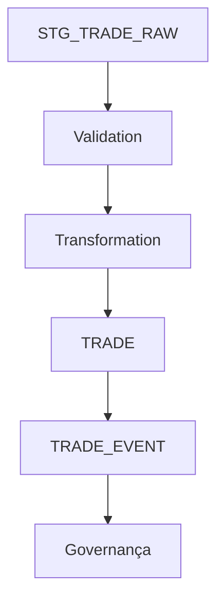

# Módulo 04 — Oracle Core

> Compreendendo a camada Oracle que sustenta todo o pipeline do Mini BOP.

---

# Objetivo

Neste capítulo você conhecerá:

- o papel do Oracle na arquitetura;
- as principais tabelas do projeto;
- o ciclo de vida de um Trade dentro da base de dados;
- a separação entre dados operacionais e governança.

---

# Oracle como núcleo operacional

No Mini BOP, o Oracle não é apenas um banco de dados.

Ele representa o **motor de processamento** responsável por:

- receber dados;
- validar regras;
- transformar informações;
- persistir Trades;
- registrar eventos;
- manter histórico operacional.

---

# Fluxo lógico

---

# Principais estruturas

| Estrutura | Papel Arquitetural |
|-----------|--------------------|
| STG_TRADE_RAW | Área de recepção dos dados brutos |
| STG_TRADE_ERROR | Registos rejeitados ou com erro |
| TRADE | Repositório curado |
| TRADE_EVENT | Histórico do ciclo de vida |
| ETL_BATCH | Controle das execuções |
| ETL_LOG | Log operacional |

---

# Por que existe uma camada de Staging?

Uma boa prática de engenharia é **não gravar diretamente** na tabela principal.

A camada de Staging permite:

- preservar a informação original;
- validar antes da persistência;
- repetir o processamento;
- facilitar auditoria e investigação.

---

# Organização das Packages

O projeto distribui responsabilidades em packages especializadas.

Exemplo conceitual:

- Scheduler
- Validation
- Transform
- Load
- Recovery
- Reconciliation
- Data Quality
- Audit & Lineage

Essa divisão favorece baixo acoplamento e alta coesão.

---

# Decisão de Engenharia

As regras de negócio permanecem separadas das responsabilidades operacionais.

Isso permite evoluir aspectos como Recovery, Observabilidade ou Performance sem alterar a lógica funcional do processamento.

---

# Relação com a Academy Big Data

Mais adiante veremos que essas mesmas responsabilidades podem ser implementadas utilizando:

- Apache Airflow (orquestração)
- Apache Spark (processamento)
- Hadoop/HDFS (armazenamento)
- dbt (transformações analíticas)

A tecnologia muda, mas as responsabilidades permanecem.

---

# Resumo

Após este capítulo você compreende:

- o papel do Oracle;
- as principais tabelas;
- a importância da camada de staging;
- a organização das packages;
- como essa arquitetura prepara o caminho para uma evolução em Data Engineering.

➡ Próximo módulo: **05_BATCH_PIPELINE.md**
