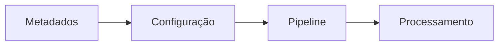

# Módulo 11 — Metadata Engine

> Entendendo como metadados apoiam automação, governança e evolução do pipeline.

---

# Objetivo

Ao final deste módulo você deverá compreender:

- o que são metadados;
- por que diferenciar dados de metadados;
- como um mecanismo baseado em metadados reduz acoplamento;
- como esse conceito é utilizado em plataformas modernas de Data Engineering.

---

# O que são Metadados?

Metadados são **dados que descrevem outros dados**.

Exemplos:

- nome de uma tabela;
- tipo de um campo;
- origem de um arquivo;
- versão de um processo;
- regras de transformação.

Enquanto um Trade representa um dado de negócio, um metadado descreve como esse Trade deve ser tratado.

---

# Dados x Metadados

| Dados | Metadados |
|--------|-----------|
| Trade | Nome da tabela do Trade |
| Valor | Tipo do campo |
| Data da operação | Regra de validação |
| Instrumento | Catálogo do domínio |

---

# Fluxo Conceitual

---

# Benefícios

- Menor dependência de código.
- Maior flexibilidade.
- Configuração centralizada.
- Facilidade de manutenção.
- Evolução mais simples.

---

# Relação com o Mini BOP

Durante o onboarding observamos que diversos componentes do projeto podem ser entendidos como responsabilidades orientadas por metadados, permitindo que o pipeline permaneça organizado e extensível.

---

# Relação com Big Data

Ferramentas modernas como Airflow, dbt, catálogos de dados e plataformas analíticas utilizam metadados extensivamente para descrever pipelines, datasets e dependências.

O conceito permanece o mesmo, independentemente da tecnologia.

---

# Resumo

Após este módulo você compreende:

- o conceito de metadados;
- a diferença entre dados e metadados;
- como um Metadata Engine apoia a arquitetura;
- por que esse conceito é importante em Data Engineering.

➡ Próximo módulo: **12_BIG_DATA_OVERVIEW.md**
