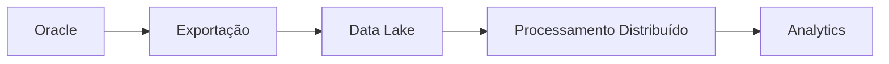

# Módulo 12 — Visão Geral de Big Data

> Relacionando a arquitetura do Mini BOP com plataformas modernas de Engenharia de Dados.

---

# Objetivo

Ao final deste módulo você deverá compreender:

- o conceito de Big Data;
- por que arquiteturas corporativas evoluem para plataformas distribuídas;
- como os conceitos do Mini BOP permanecem válidos em ambientes modernos;
- como Oracle e Big Data podem coexistir.

---

# O que é Big Data?

Big Data não significa apenas grandes volumes de dados.

O termo também envolve:

- Volume
- Velocidade
- Variedade
- Veracidade
- Valor

Essas características exigem arquiteturas capazes de processar dados de forma escalável e distribuída.

---

# Do Oracle ao Big Data

A arquitetura do Mini BOP foi construída sobre Oracle, mas seus conceitos podem ser mapeados para plataformas modernas.

| Mini BOP | Plataforma Moderna |
|-----------|--------------------|
| Oracle | Data Platform |
| Batch | Workflow |
| Packages | Jobs |
| Transformação | Spark / dbt |
| Exportação | Data Lake |
| Governança | Catálogo / Observabilidade |

---

# Fluxo Conceitual

---

# Conceitos preservados

Mesmo com a mudança de tecnologia, permanecem os princípios de:

- validação;
- transformação;
- recuperação;
- reconciliação;
- qualidade;
- auditoria;
- lineage.

A tecnologia muda, mas as responsabilidades arquiteturais continuam.

---

# Benefícios da Evolução

Uma plataforma Big Data permite:

- maior escalabilidade;
- processamento distribuído;
- integração com Analytics;
- suporte a Machine Learning;
- melhor exploração de grandes volumes.

---

# Relação com a Academy

Os próximos estudos aprofundarão tecnologias como:

- Hadoop
- Spark
- Hive
- Airflow
- dbt
- Snowflake

sempre relacionando esses conceitos à arquitetura já estudada no Mini BOP.

---

# Resumo

Após este módulo você compreende:

- o papel do Big Data;
- a continuidade dos conceitos arquiteturais;
- como o Mini BOP prepara essa evolução.

➡ Próximo módulo: **13_ENGINEERING_DECISIONS.md**
